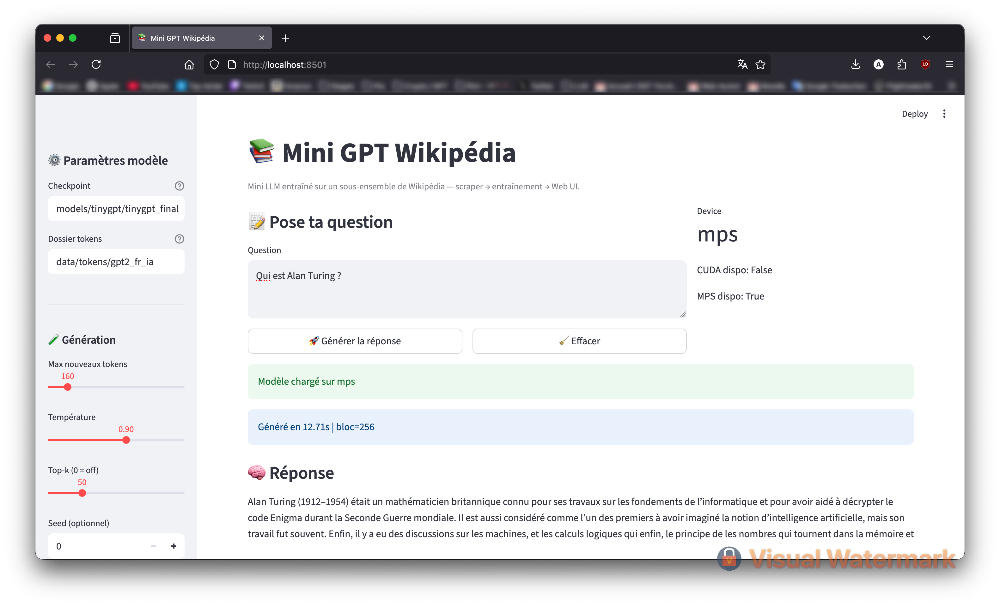

# Mini GPT Wikipédia

Petit projet **Personnel** pour construire un **mini GPT** entraîné sur un sous-ensemble de **Wikipédia🇫🇷**, en 3 parties :

1. **Scraper** : collecte propre depuis l’API Wikipédia, à partir d’une page « mère » et en explorant ses liens (profondeur contrôlée).
2. **Entraînement** : un **TinyGPT** (transformer causal) minimal, entraîné sur les textes tokenisés.
3. **Using** : une **app Streamlit** pour chatter avec le modèle.

> Le code détecte automatiquement **CUDA → MPS → CPU**. Conçu pour tourner sur **Mac (Apple Silicon)** comme sur Linux/Windows.

---


## 🖼️ Aperçu de l'interface





---

## ⚙️ Prérequis
- Python **3.10+**
- **PyTorch** 2.2+ (avec MPS sur Mac, ou CUDA si dispo)
- Accès internet pour le scraping

---

## 🚀 Installation

```bash
# (Optionnel) environnement virtuel
python3 -m venv .venv && source .venv/bin/activate

# Installer PyTorch (voir la commande adaptée sur pytorch.org si GPU CUDA)
pip install torch torchvision torchaudio

# Dépendances du projet
pip install -r requirements.txt
```

`requirements.txt` minimal :
```
wikipedia-api
mwparserfromhell
transformers>=4.41
torch>=2.2
numpy==1.26.4
tqdm
streamlit
```

---

## 🗂️ Arborescence
```
mini-gpt-wiki/
├─ data/
│  ├─ raw/                  
│  └─ tokens/               
├─ models/
│  └─ tinygpt/              
├─ scraper/
│  └─ wiki_scraper.py       
├─ training/
│  ├─ dataset.py           
│  ├─ tiny_gpt.py          
│  ├─ train.py               
│  └─ generate.py           
├─ app/
│  └─ app_streamlit.py     
├─ requirements.txt
└─ README.md
```

---

## 🧭 Workflow 

### 1) Scraper Wikipédia
Choisir une **page mère**, la **langue**, la **profondeur** et un **max de pages** (exemple FR sur *Intelligence artificielle*).

```bash
python scraper/wiki_scraper.py "Intelligence artificielle" \
  --lang fr --depth 1 --max_pages 300 --sleep 0.2 \
  --user_agent "MiniGPTWiki/1.0 (prenom; prenom@exemple.com)" \
  --out data/raw/wiki_fr_ia.jsonl
```

> Le script affiche une barre de progression `Scraping pages` et crée `data/raw/wiki_fr_ia.jsonl`.

### 2) Construire le dataset tokenisé

```bash
python -c "from training.dataset import build_token_dataset; \
build_token_dataset('data/raw/wiki_fr_ia.jsonl','data/tokens/gpt2_fr_ia')"

ls -lh data/tokens/gpt2_fr_ia
cat data/tokens/gpt2_fr_ia/meta.json
```

### 3) Entraîner le mini-GPT

```bash
python training/train.py
```

- Le script choisit automatiquement le **device** (CUDA → MPS → CPU).
- Les checkpoints sont écrits dans `models/tinygpt/` (ex. `tinygpt_final.pt`).

> **Preset POC (optionnel)** : dans `train.py`, à la fin, tu peux remplacer l’appel par :
```python
train(max_steps=800, batch_size=12, d_model=320, n_layer=4, n_head=4, block_size=256)
```

### 4) Générer en CLI (Utiliser le LLM dans le terminal)

```bash
python training/generate.py
```

> Modifie le prompt dans `generate.py` si besoin.

### 5) Lancer l’app Streamlit (Utiliser le LLM sur une interface WEB)

```bash
streamlit run app/app_streamlit.py
```
Dans l’UI :
- **Checkpoint** : `models/tinygpt/tinygpt_final.pt`
- **Tokens dir** : `data/tokens/gpt2_fr_ia`

---

## 🧠 Détails techniques

### Détection du device
Les scripts utilisent :
```python
if torch.cuda.is_available(): device = 'cuda'
elif torch.backends.mps.is_available(): device = 'mps'
else: device = 'cpu'
```

### Tokenizer
- Par défaut : **GPT‑2 byte-level** via `transformers` (bon compromis FR/EN).
- Les textes sont concaténés avec un séparateur `eos` avant tokenisation.

### Modèle TinyGPT
- Architecture GPT minimale : embeddings, blocs Transformer (MSA + MLP), masque causal, `LayerNorm` final.
- Paramètres par défaut (POC): `d_model=320`, `n_layer=4`, `n_head=4`, `block_size=256`, `dropout=0.1`.

### Entraînement
- Optimiseur : **AdamW**.
- **Gradient clipping** = 1.0.
- Évaluations périodiques sur `val.bin` (perte moyenne).


---

## 📈 Conseils & pistes d’amélioration
- Apprendre un **tokenizer BPE** dédié (lib `tokenizers`) pour de meilleures stats FR.
- Passer à **RMSNorm**, **poids partagés**, ou **FlashAttention** (si CUDA) pour accélérer/stabiliser.
- Curriculum learning : commencer avec des séquences courtes puis augmenter `block_size`.
- Évaluer avec perplexité + QA de contrôle.


---


## Auteur : Arthur PRIGENT

Projet personnel visant à maitriser les outils de développement et de jouer avec les hyper-paramètres d'un LLM.

